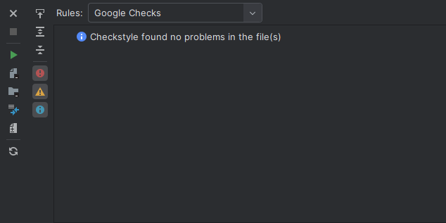
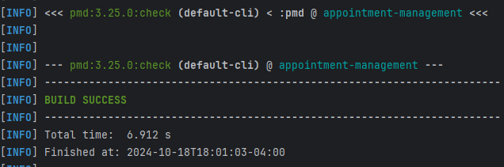

# Appointment-Management-Service

Welcome to our Appointment-Management-Service! This is a team Project for our team DLJL. Our members are Ziyue Jin, Ken Deng, Jiacheng Liu, Yang Li.

## Building and Running a Local Instance

In order to build and use our service, you must install the following dependencies:

1. **Maven 3.9.5**: Download Maven: (https://maven.apache.org/download.cgi) and follow the installation instructions. Be sure to set the `bin` path as described in Maven's README. You are recommended to add the path in the source file of bash or zsh.
   
2. **JDK 17**: This project is developed with JDK 17. You can download JDK 17: (https://www.oracle.com/java/technologies/javase/jdk17-archive-downloads.html) from Oracle's website and install it.

3. **MyBatis**: Our project uses MyBatis framework. If needed, refer to the official MyBatis Documentation: (https://mybatis.org/mybatis-3/).

4. **MySQL**: Install and set up MySQL. For local development, we recommend MySQL Workbench for easier management. Create a database locally and ensure the connection details are properly set up in the project’s configuration file : application.properties.

5. **Cloning the Project**: you can clone the repository from GitHub. Click the green "Code" button on the repository page, copy the HTTP/SSH link, and use it to clone the project locally. You can also use Github Desktop!

6. **Building the Project**: Once cloned, use Maven to build the project by running: <code>mvn clean install</code> 

7. **Running the Project**: Once built, you can run this project by <code>mvn spring-boot:run</code> 

8. **Getting Code Coverage Report** : You can check code coverage report by running <code>mvn jacoco:report</code>

## Running test
We provided unit tests under the directory src/test
You are welcome to test our end points after running an instance. We recommend using Postman or Bruno


## Running a Cloud Based Instance


## Running test
We provided unit tests under the directory src/test. You can also test by running <code>mvn clean test</code> 
You are welcome to test our end points after running an instance. We recommend using Postman or Bruno

## Endpoints

This section describes the endpoints that our service provides, as well as their inputs and outputs. 
We also provided some input examples.

### POST /register-client

### POST /appointments/createAppointment

- **Expected Input Parameters:** `CreateAppointmentDto` (JSON)
  ```json
  {
    "providerId": 1,
    "userId": 2,
    "startDateTime": "2024-10-15T10:10:00",
    "endDateTime": "2024-10-15T11:25:00",
    "status": "CONFIRMED",
    "serviceType": "Lecture",
    "comments": "Advanced Software Engineering"
  }
- **Expected Output:** `Appointment` (JSON)
- Registers a new appointment. This requires provider id, user id, start date time, end date time, status, service type, comments. This endpoint should be used to create a one-time appointment.

- **Upon Success:** `HTTP 201` status code is returned along with the created `Appointment` object in the response body.
- **Upon Failure:**
  - `HTTP 400` status code is returned if the appointment has a time conflict : 
    "The selected time slot is not available or conflicts with an existing appointment. " ;
  - `HTTP 500` status code is returned with the message "An unexpected error occurred: [error message]" if there is a server-side issue.


### POST /appointments/createBlock

- **Expected Input Parameters:** `CreateBlockDto` (JSON)
  ```json
    {
      "providerId": 1,
      "startDateTime": "2024-010-01T10:00:00",
      "endDateTime": "2024-010-01T21:00:00"
    }
- **Expected Output:** `Message` (String)
- Creates a single block. You need to provide a start date time, end date time and the provider id to create the block.

- **Upon Success:** `HTTP 201` status code is returned along with a message "Block Created Successfully" confirming the creation of the block.
- **Upon Failure:**
  - `HTTP 400` status code is returned if it has a conflict: 
    "The selected time slot is not available or conflicts with an existing appointment. To block this time, please cancel the conflicting appointment or block.";
  - `HTTP 500` status code is returned with the message "An unexpected error occurred: [error message]" if there is a server-side issue.


### POST /appointments/createRecurringBlockInOneYear

- **Expected Input Parameters:** `CreateRecurringBlockInOneYearDto` (JSON)
  ```json
  {
    "providerId": 1,
    "startTime": "10:10",
    "endTime": "11:25"
  }
- **Expected Output:** `Message` (String)
- Creates a recurring block for the following one year. You need to provide a start time, end time and the provider id to create the block. It would remind you of any conflicts it encounters.

- **Upon Success:** `HTTP 201` status code is returned along with a message "Yearly recurring block created successfullyy" confirming the creation of the blocks.
- **Upon Failure:**
  - `HTTP 400` status code is returned if it has a conflict: "Conflicts found on the following dates: ..." or because of the provider id is null: "Provider ID Can't be null."
  - `HTTP 500` status code is returned with the message "An unexpected error occurred: [error message]" if there is a server-side issue.


### PUT /appointments/update
- **Expected Input Parameters:** `UpdateAppointmentDto` (JSON)
  ```json
  {
    "appointmentID": 1, //required
    "providerId": 1, //optional
    "userId": 2,  //optional
    "startDateTime": "2024-10-15T10:10:00",  //optional
    "endDateTime": "2024-10-15T11:25:00",  //optional
    "status": "CONFIRMED",  //optional
    "serviceType": "Lecture",  //optional
    "comments": "Advanced Software Engineering"  //optional
  }
- **Expected Output:** `Appointment` (JSON)
- Update a appointment with the service. This requires appointment id. This endpoint should be update a one-time appointment.

- **Upon Success:** `HTTP 200` status code is returned along with the updated `Appointment` object in the response body.
- **Upon Failure:**
  - `HTTP 400` status code is returned if the appointment is not updated


### PUT /appointments/cancel/{id}
- **Expected Input Parameters:** `appointment id` (PathVariable Long)
- **Expected Output:** `Message` (String)
- Cancel a appointment by setting its status to cancelled. This requires appointment id. This endpoint should cancel a one-time appointment.

- **Upon Success:** `HTTP 200` status code is returned along with the message "Appointment cancelled successfully."
- **Upon Failure:**
  - `HTTP 400` status code is returned if the appointment does not exist : "Appointment not found or already cancelled."


### GET /appointments/{id}
- **Expected Input Parameters:** `appointment id` (PathVariable Long)
- **Expected Output:** `Appointment` (JSON)
- Get a appointment by its id. This requires appointment id. This endpoint should get a one-time appointment.

- **Upon Success:** `HTTP 200` status code is returned along with with the `Appointment` object in the response body.
- **Upon Failure:**
  - `HTTP 404` status code is returned if the appointment is not found


### GET /appointments/provider/{providerId}
- **Expected Input Parameters:** `providerId` (PathVariable Long)
- **Expected Output:** `Appointments` (List of Appointment)
- Get all appointments of one provider. The appointment requires provider id. This endpoint should get a list of one-time appointments.

- **Upon Success:** `HTTP 200` status code is returned along with with the list of `Appointment` object in the response body.


### GET /appointments/provider/{providerId}/date/{appointmentDate}
- **Expected Input Parameters:** `providerId` (PathVariable Long),  `AppointmentDate` (LocalDate)
- **Expected Output:**  `Appointments` (List of Appointment)
- Get all appointments of one provider at a specific date. The appointment requires provider id and a local date. This endpoint should get a list of one-time appointments.

- **Upon Success:** `HTTP 200` status code is returned along with with the list of `Appointment` object in the response body.


### GET /appointments/provider/{providerId}/available/date/{appointmentDate}
- **Expected Input Parameters:** `providerId` (PathVariable Long),  `AppointmentDate` (LocalDate)
- **Expected Output:**  `Intervals` (List of List of Local Time)
- Get all available intervals of one provider at a specific date. The intervals require provider id and a local date. This endpoint should get a list of list of local time.

- **Upon Success:** `HTTP 200` status code is returned along with with the list of list of local time (intervals).


### GET /appointments/hisory
- **Expected Input Parameters:** `providerId` (PathVariable Long),  `userId` (PathVariable Long)
- **Expected Output:**  `History` (List<Map<String, Object>>)
- Get all appointment history of one provider with one user. This requires provider id and a user id. This endpoint should get a list of map.

- **Upon Success:** `HTTP 200` status code is returned along with with the hirtory object.

## Code Coverage Report

The project uses [JaCoCo](https://www.jacoco.org/) (Java Code Coverage Library) to measure the code coverage of our unit tests. JaCoCo is integrated with our build process, and it automatically generates reports detailing the coverage of the codebase, including the percentage of lines and branches covered by the tests.

After running the tests, JaCoCo produces a detailed report in formats like HTML, XML, and CSV that can be viewed for an in-depth analysis of the coverage.

To generate the report, run the following command:

```bash
mvn clean test jacoco:report
```


## Style Checking Report

We used the tool **Checkstyle** to check the style of our code and ensure it adheres to industry-standard best practices. Checkstyle helps us maintain code consistency and ensures that our codebase follows the rules defined by the **Google Java Style Guide**.
### Tool Used:
- **Checkstyle**: A development tool to help programmers write Java code that adheres to a coding standard. We use the `maven-checkstyle-plugin` to integrate Checkstyle into our build process.

### Configuration:
- We used the **Google Java Style** for our Checkstyle setup.
- Both source and test directories are included in the style checks.

### Running Style Checks:
To run the Checkstyle checks locally and generate a report, use the following Maven command:
```bash
mvn checkstyle:checkstyle
```


## Static Analysis

We used the tool **PMD** to as the static checker to find potential bugs and bad practices. We used the default ruleset from PMD.



## Project Management

Our project is managed through Jira. You can view our work and progress by visiting [our Jira board](https://columbia-team-dljl.atlassian.net/jira/software/projects/SCRUM/boards/1?atlOrigin=eyJpIjoiNTQ2ZjhkNmU2OTMwNDQ1YjllN2ViYzUyZjVhMDRjYmYiLCJwIjoiaiJ9).
